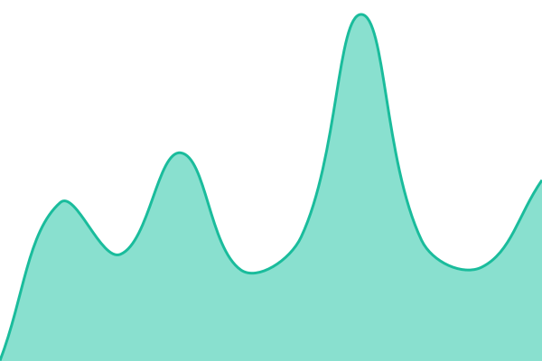

# [📈 Live Status]<!--live status--> **🟧 Partial outage**

This repository contains the open-source uptime monitor and status page for [Howielyn](https://demo.upptime.js.org), powered by [Upptime](https://github.com/upptime/upptime).

<!--start: status pages-->
<!-- This summary is generated by Upptime (https://github.com/upptime/upptime) -->
<!-- Do not edit this manually, your changes will be overwritten -->
<!-- prettier-ignore -->
| URL | Status | History | Response Time | Uptime |
| --- | ------ | ------- | ------------- | ------ |
|  [Catbox](https://catbox.moe) | 🟩 Up | [catbox.yml](https://github.com/Howielyn/Cloud-Status/commits/HEAD/history/catbox.yml) | 

 377ms
     
 | 

<a href="https://Howielyn.github.io/Cloud-Status/history/catbox">100.00%</a>
    

|  [Catbox Litterbox](https://litterbox.catbox.moe) | 🟥 Down | [catbox-litterbox.yml](https://github.com/Howielyn/Cloud-Status/commits/HEAD/history/catbox-litterbox.yml) | 

 5101ms
     
 | 

<a href="https://Howielyn.github.io/Cloud-Status/history/catbox-litterbox">87.99%</a>
    

|  [Filebin](https://filebin.net) | 🟩 Up | [filebin.yml](https://github.com/Howielyn/Cloud-Status/commits/HEAD/history/filebin.yml) | 

 592ms
     
 | 

<a href="https://Howielyn.github.io/Cloud-Status/history/filebin">100.00%</a>
    

|  [Google Drive](https://drive.google.com/drive/my-drive) | 🟩 Up | [google-drive.yml](https://github.com/Howielyn/Cloud-Status/commits/HEAD/history/google-drive.yml) | 

 428ms
     
 | 

<a href="https://Howielyn.github.io/Cloud-Status/history/google-drive">100.00%</a>
    

|  [Pcloud](https://my.pcloud.com/#/filemanager) | 🟩 Up | [pcloud.yml](https://github.com/Howielyn/Cloud-Status/commits/HEAD/history/pcloud.yml) | 

 499ms
     
 | 

<a href="https://Howielyn.github.io/Cloud-Status/history/pcloud">100.00%</a>
    

|  [Drime](https://app.drime.cloud/drive) | 🟩 Up | [drime.yml](https://github.com/Howielyn/Cloud-Status/commits/HEAD/history/drime.yml) | 

 597ms
     
 | 

<a href="https://Howielyn.github.io/Cloud-Status/history/drime">100.00%</a>
    

<!--end: status pages-->

[**Visit our status website →**](https://howielyn.github.io/Cloud-Status/)

## 📄 License

- Powered by: [Upptime](https://github.com/upptime/upptime)
- Code: [MIT](./LICENSE) © [Anand Chowdhary](https://anandchowdhary.com), supported by [Pabio](https://pabio.com)
- Data in the `./history` directory: [Open Database License](https://opendatacommons.org/licenses/odbl/1-0/)
